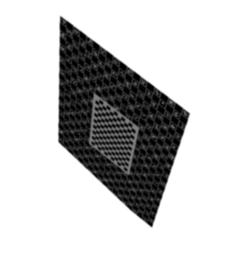

Rendering Generator
^^^^^^^^^^^^^^^^^^^

Renderings can be generated from one (or more) model files, with optional texturing, and a background image.

Rendering Images
----------------

The generator requires positions for the camera and the model, as well as for the stereo separation, if stereo rendering is being used.
Details of the models to be used, the background image, and camera intrisics are also needed.

.. literalinclude:: ../../tests/widgets/test_rendering_generator.py
    :language: python
    :start-after: #Tutorial-section1
    :end-before: #Tutorial-section2

The rendering can now be generated, and some optional post processing carried out, to set a z clipping range, and apply some smoothing.

.. literalinclude:: ../../tests/widgets/test_rendering_generator.py
    :language: python
    :start-after: #Tutorial-section2
    :end-before: #Tutorial-section3

The rendered image can be retrieved with a `get_image()` call, and can then be saved to disk, passed to another function etc.

.. literalinclude:: ../../tests/widgets/test_rendering_generator.py
    :language: python
    :start-after: #Tutorial-section3
    :end-before: #Tutorial-section4

