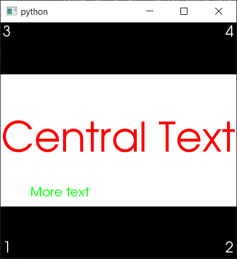

Add Text to VTKOverlayWindow
^^^^^^^^^^^^^^^^^^^^^^^^^^^^

Classes are provided that can add persistent text to a VTKOverlayWindow as:

* Corner annotations
* Large centered text
* Generic text anywhere in the window

First, we need to import relevant modules, setup a Qt Application, and create a VTKOverlayWindow.

.. literalinclude:: ../../tests/tutorials/test_text_overlay_tutorial.py
    :language: python
    :start-after: #Tutorial-start
    :end-before: #Tutorial-section1

.. code-block:: python

   app = QtWidgets.QApplication([])

We can now create a corner annotations:

.. literalinclude:: ../../tests/tutorials/test_text_overlay_tutorial.py
    :language: python
    :start-after: #Tutorial-section1
    :end-before: #Tutorial-section2

centred text:

.. literalinclude:: ../../tests/tutorials/test_text_overlay_tutorial.py
    :language: python
    :start-after: #Tutorial-section2
    :end-before: #Tutorial-section3

and place some text at given co-ordinates in the window:

.. literalinclude:: ../../tests/tutorials/test_text_overlay_tutorial.py
    :language: python
    :start-after: #Tutorial-section3
    :end-before: #Tutorial-end

`layer=2` is typically used for text overlay (layer 0 is the background image and layer 1 is used for VTK models).
Finally, we execute the Qt app to show the window:

.. code-block:: python

   overlay_window.show()
   sys.exit(app.exec_())

