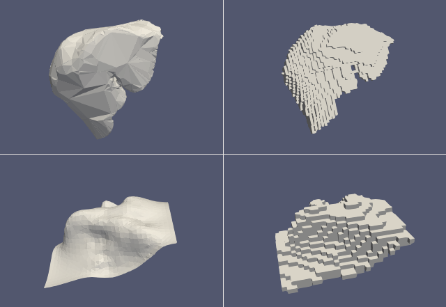
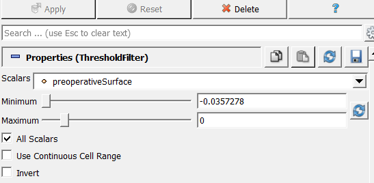
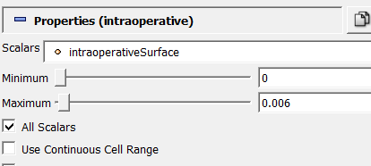

Distance Field Calcualtion & Voxelisation
=========================================

This tutorial demonstrates how to generate voxelised data and calculate distance fields, originally
for use with the `Volume2SurfaceCNN <https://gitlab.com/nct_tso_public/Volume2SurfaceCNN>`_ model.

We will use the example of a liver model and intraoperative surface, but this can be applied to any 3D
model and partial surface. Data used for this example can be found in the `GitHub repository <https://github.com/UCL/scikit-surgeryvtk>`_.

**Figure 1 - Original model/surface (left) and voxelised model/surface (right)**

Creating a signed distance field from a 3D model
~~~~~~~~~~~~~~~~~~~~~~~~~~~~~~~~~~~~~~~~~~~~~~~~

Setup parameters:

.. literalinclude:: ../../tests/models/test_voxelise.py
    :language: python
    :start-after: #Tutorial-section-1-start
    :end-before: #Tutorial-section-1-end

Run voxelisation function:

.. literalinclude:: ../../tests/models/test_voxelise.py
    :language: python
    :start-after: #Tutorial-section-2-start
    :end-before: #Tutorial-section-2-end

The `voxelise` function returns a vtkStructuredGrid, but it also writes the data
to the file specified by `output_grid`, which now contains a 3D volume, and a
data array `preoperativeSurface`, which stores the distance value for each
voxel in the grid.

Negative distance values indicate that the element is inside the surface. We can
use this property to visualise the voxelised model using suitable software, e.g. ParaView.

If we apply a threshold filter only showing negative values, this will show the model surface:

Creating an usigned distance field from a surface
~~~~~~~~~~~~~~~~~~~~~~~~~~~~~~~~~~~~~~~~~~~~~~~~~

The process for creating a distance field for a surface is similar, except we calculate
the unsigned distance field, which will be stored in a data array 'intraoperativeSurface'.

.. literalinclude:: ../../tests/models/test_voxelise.py
    :language: python
    :start-after: #Tutorial-section-3-start
    :end-before: #Tutorial-section-3-end

The distance field can be calculated from a file, as above, or from a numpy array:

.. literalinclude:: ../../tests/models/test_voxelise.py
    :language: python
    :start-after: #Tutorial-section-4-start
    :end-before: #Tutorial-section-4-end

We can visualise the intraoperative surface, by using a threshold filter between
0 and the (roughly) voxel size, which is equal to `size/grid_elements`

